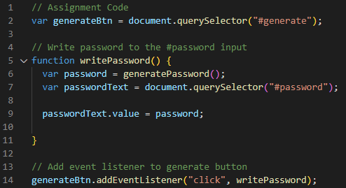

# 03 JavaScript: Password Generator

## Task
This is a password generator created with HTML, CSS and JavaScript. The HTML and CSS files are already provided which are untouched, with the focus of the assignment on JavaScript. There was some starter code as shown below:

## Functionality
The following images show the web application's appearance and functionality:

Upon clicking the red "Generate Password" button, the user will be prompted to answer a few questions, including the desired length of the password, as well as if uppercase, lowercase, numeric and special characters should be included. Functionality of the code includes an error message if there is an incorrect input for the desired length. 

## Deployment
Github Repository Link: https://github.com/edwardlui1/password-generator

Live Deployment Link: 